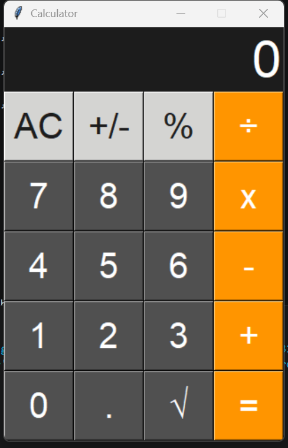

# Calculator
Desktop calculator built with Python and Tkinter, inspired by the iOS design.

# 🧮 Calculator

A fully functional desktop calculator built with Python and Tkinter, inspired by the iOS calculator design.

## 📸 Preview



## 🚀 Features

- Basic operations: addition, subtraction, multiplication, and division
- Square root (√)
- Percentage (%)
- Toggle positive/negative (+/-)
- Handles division by zero gracefully — displays an error instead of crashing
- Clean iOS-inspired design with color-coded buttons
- Launches centered on the screen

## 🛠️ Built With

- **Python 3**
- **Tkinter** — standard Python GUI library (no extra installs needed)

## ▶️ How to Run

1. Make sure you have **Python 3** installed.
2. Clone this repository:
   ```bash
   git clone https://github.com/VelosoMiguel/calculator.git
   ```
3. Navigate to the project folder:
   ```bash
   cd calculator
   ```
4. Run the application:
   ```bash
   python Calculator.py
   ```

## 🎨 Design

The layout and color scheme are inspired by the iOS calculator:
- **Light gray** buttons for utility functions (AC, +/-, %)
- **Orange** buttons for operators and equals
- **Dark gray** buttons for numbers and decimal

## 🔮 Future Improvements

- [ ] Keyboard support
- [ ] Calculation history log
- [ ] Scientific mode (sin, cos, log, etc.)

## 👤 Author

**Miguel Veloso**  
[GitHub](https://github.com/VelosoMiguel) · [LinkedIn](https://www.linkedin.com/in/miguel-veloso-91355b372/)
